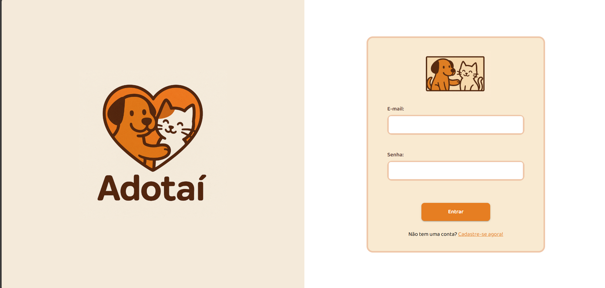
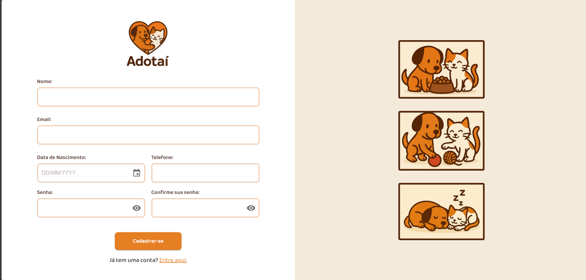
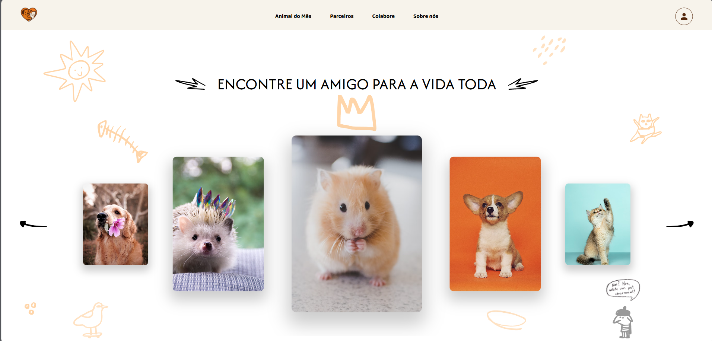
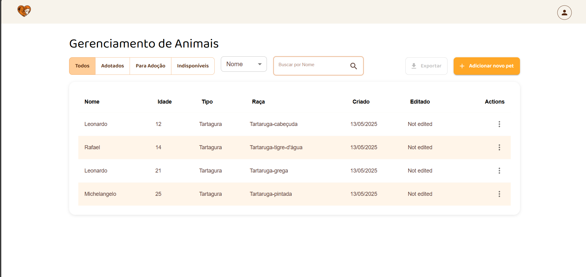

# Adotai Pets Frontend

Adotai Pets Frontend is a web application designed to help users find and adopt pets. This project serves as the frontend interface for the Adotai Pets platform.

## Features

- Pet management for organizations:
  - Create, edit, and list pets created by the organization.
- User-friendly interface for managing adoption requests.
- Login, register, landing, and management pages.
- Adoption module (WIP)

## Example Pages

### Login Page


The login page allows users to securely log in to their accounts. It includes fields for email and password, with validation and error handling.

### Register Page


The register page enables new users to create an account. It includes fields for personal information, such as name, email, phone, and password, with validation.

### Landing Page


The landing page serves as the homepage of the application, showcasing featured pets and providing navigation to other sections of the platform.

### Animal Management Page


The animal management page is designed for organizations to manage their listed pets. It includes features to create, edit, and list pets, along with advanced filtering options.

## Project Architecture

The project follows a modular architecture to ensure scalability and maintainability. Below is an overview of the directory structure:

```
adotai-pets-frontend
├── docs
├── public
│   └── assets
└── src
    ├── auth
    │   ├── organization
    │   │   ├── constants
    │   │   ├── login
    │   │   │   └── services
    │   │   └── register
    │   │       └── services
    │   └── user
    │       ├── constants
    │       ├── login
    │       │   └── services
    │       └── register
    │           └── services
    ├── components
    │   └── decorations
    │       └── svg
    ├── constants
    ├── contexts
    ├── pages
    │   ├── animalManagement
    │   │   ├── components
    │   │   ├── constants
    │   │   └── services
    │   ├── home
    │   │   └── constants
    │   ├── login
    │   ├── register
    │   ├── landing
    │   └── management
    ├── routers
    ├── services
    │   └── axios-config
    │       └── interceptors
    ├── theme
    └── types
```

## Installation

1. Clone the repository:
   ```bash
   git clone https://github.com/your-username/adotai-pets-frontend.git
   ```
2. Navigate to the project directory:
   ```bash
   cd adotai-pets-frontend
   ```
3. Install dependencies:
   ```bash
   npm install
   ```

## Usage

1. Start the development server:
   ```bash
   npm start
   ```
2. Open your browser and navigate to `http://localhost:3000`.

## Authentication

The authentication system in Adotai Pets Frontend is designed to ensure secure access to protected resources and user data. Here's how it works:

1. **Token-Based Authentication**:  
   Upon successful login, the server generates a secure token (JWT or similar) and sends it to the client. This token is stored in a secure cookie on the client side.

2. **Secure Cookie Storage**:  
   The authentication token is stored using `js-cookie` with the following security measures:

   - **Expiration**: The token expires after 2 days, ensuring it cannot be used indefinitely.
   - **Secure Flag**: The cookie is marked as secure, meaning it is only transmitted over HTTPS.
   - **SameSite Policy**: The cookie uses the `strict` SameSite policy to prevent cross-site request forgery (CSRF) attacks.

3. **Automatic Token Management**:  
   The token is automatically updated in the cookie whenever it changes, and it is removed when the user logs out.

4. **Protected Routes**:  
   Routes that require authentication are wrapped in the `AuthProtectedRoute` component. This component checks if the user is authenticated before granting access. If the user is not authenticated, they are redirected to the login page.

5. **Server-Side Validation**:  
   The server validates the token on every request to ensure it is valid and has not been tampered with.

### Why It's Secure

- **HTTPS-Only Cookies**: The secure flag ensures that the token is only transmitted over encrypted HTTPS connections, preventing interception by attackers.
- **SameSite Policy**: The strict SameSite policy mitigates CSRF attacks by ensuring the cookie is only sent with requests originating from the same site.
- **Short Token Lifespan**: The token's expiration reduces the risk of misuse if it is compromised.
- **Centralized Validation**: The server validates the token on every request, ensuring that only valid tokens can access protected resources.
- **No Local Storage**: Tokens are not stored in local storage or session storage, reducing the risk of XSS attacks.

This approach ensures that user data and resources are protected while providing a seamless authentication experience.

## License

This project is licensed under the MIT License. See the [LICENSE](LICENSE) file for details.
